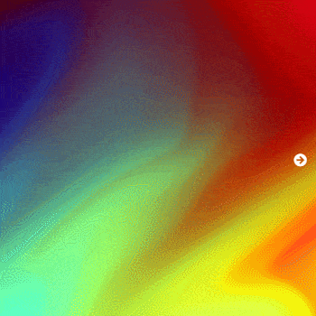

# Slow I



[demo](https://ray7551.github.io/sketch/slow_nothing)

## Masking Transition

## Draw Modes Cycling
There are many draw mode, they produce many different (looks similar) gradient flowing thing, but we only render 2 modes at most (when masking transition happening), and we need shift the first mode when next transition start.

Let's define a array to contain the 2 modes for masking transition:

```js
const currentMode = [modes[0], modes[1]]; // initialize it with first 2 modes
```

Once switch button clicked, we cycling draw modes:

```js
const modes = ['modeWater', 'modeSlow1','modeOrigin',  'modeSlow2'];
// cycleDraw2FragData depend on these status
let currentMode = [], currentModeIndex;
// draw modes cycling
function cycleDraw2FragData(increment = 1) {
  if (typeof currentModeIndex === 'undefined') {
    currentMode[0] = modes[0];
    currentMode[1] = modes[1];
    currentModeIndex = 1;
  } else {
    currentMode[0] = currentMode[1];
    // mod modes.length to cycling
    const nextIndex = currentModeIndex + increment;
    currentMode[1] = modes[Math.abs(nextIndex) % modes.length];
    currentModeIndex = nextIndex;
  }

  return regl({
    frag: () => `precision mediump float;
  #extension GL_EXT_draw_buffers : require
  #define SEED ${seed}
  #define MODE0 ${currentMode[0]}
  #define MODE1 ${currentMode[1]}
  ` + glslify.file('../glsl/fragData.glsl'),
    framebuffer: fbo
  });
}

// initial draw2FragData
let draw2FragData = cycleDraw2FragData();

UI.onSwitch('switch', (e, el) => {
  // for prev button, dataset['increment'] is -1, for next it's 1
  draw2FragData = cycleDraw2FragData(parseInt(el.dataset['increment']));
});
```

This is similar to the prticle states cycling process of this [Particles Flowing case](https://bl.ocks.org/pbeshai/dbed2fdac94b44d3b4573624a37fa9db) by Peter Beshai, from which I get inspiration.